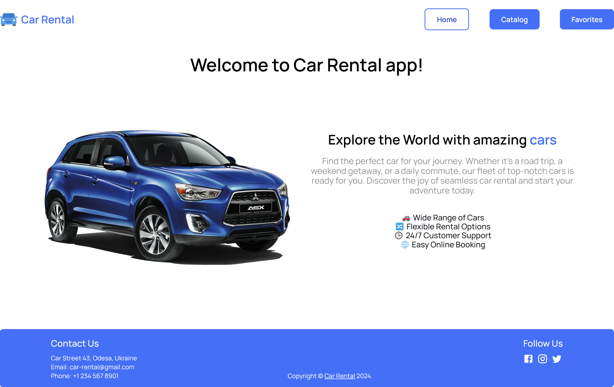
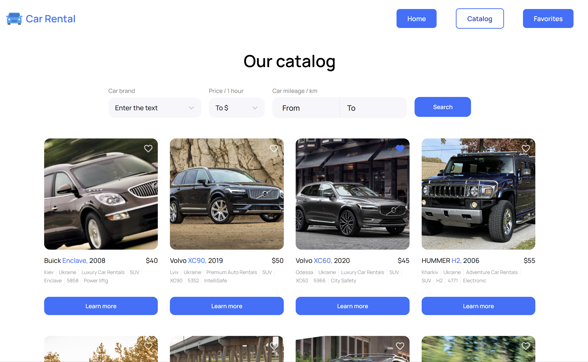

# Car Rental - React app 

Car Rental App - Drive in Style and Comfort 🚗 Explore the Car Rental app, a dynamic and user-friendly solution designed to enhance your car rental experience.

## About the project

Users can:

- explore an extensive catalog showcasing different cars with detailed   information about make, model, and specifications.

- easily filter cars by make and price to find the perfect vehicle that suits your preferences and budget.

- rent a car hassle-free by selecting your desired vehicle, checking availability, and completing the rental process.

## Home

## Catalog

## Favorites

## Technologies used:

- Frontend: HTML, CSS, React, React-Router ReduxTk, Axios, Styled Components, Marerial UI

- Backend: Mock.api

## Installation & Scripts

1. Clone the repository: 
   `git clone https://github.com/georgijbudik/car-rental-app`
2. Install the dependencies: `npm install`
3. Run development mode: `npm run dev`
4. Start local server: `npm start`
5. Run production build: `npm build`

## Happy driving! 🚗
